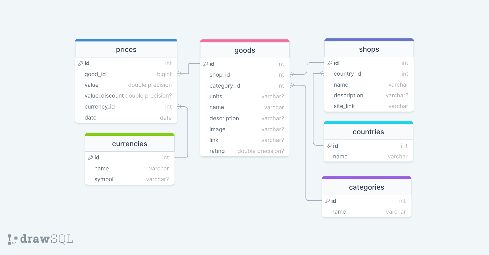

# Grocery store aggregator

"Grocery store aggregator" is a website that allows you to compare products from different stores by category. In addition, it provides data on the price change history of a product.

## Site page description
- **Home page** (aka the product catalog). It contains:
    - List of product cards with basic some basic product data;
    - Product category filter;
    - Pagination.
- **Product page**. It contains:
    - Comprehensive product description;
    - Historical data on changes in product price.

## Database
PostgreSQL is used as a database.

## Database model


## Setting up and running the application

### Clone the project
```
git clone https://github.com/Didod5/Grocery_store_aggregator.git
```
This Command will copy a full project to your local environment.

### Create and activate virtual enviroment
```
python -m venv <my_env_name>
<my_env_name>\Scripts\activate 
```

### Install the dependencies
```
pip install -r requirments.txt
```
## Create config.py & set values for the base variables
```
CATEGORIES = [
    {'name': 'some_category_name', 'link': '/?category=some_category_name'},
    ...
]
OFFSET = 12 #number of products on the main page
SQLALCHEMY_DATABASE_URI ='your database link'
```
## Run 
```
set FLASK_APP=webapp && set FLASK_ENV=development && set FLASK_DEBUG=1 && flask run
```
